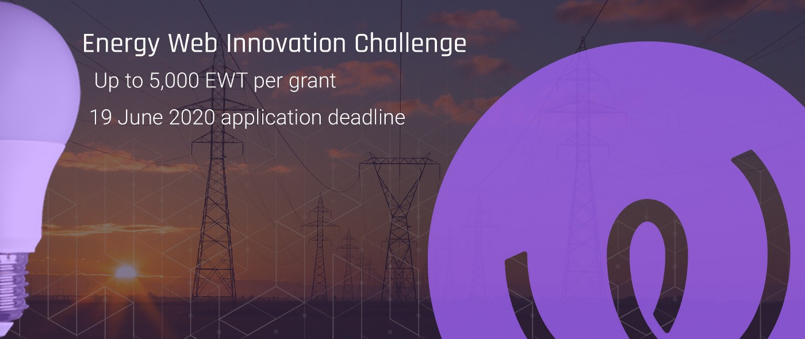

# Energy Web Innovation Challenge

# Table of contents
### About EW Innovation Challenge
1. Introduction
2. Who should apply?
3. What are we looking for?
4. Innovation Challenge Evaluation
### Application Process
1. Open source submissions
2. Application Creation
3. Application Submission
4. HubSpot Form Submission
5. Review
### Resources
1. Additional Information
2. How to reach us
### License

# About EW Innovation Challenge
## Introduction
To celebrate the one-year anniversary of the [Energy Web Chain’s launch](https://medium.com/energy-web-insights/energy-web-foundation-launches-worlds-first-public-open-source-enterprise-grade-blockchain-3a67fc457341), Energy Web is proud to announce an open call for innovative ideas to support our nonprofit mission to decarbonize the global energy sector via open-source, digital, decentralized technologies. Our ambition is bold—[10 gigatons of additional decarbonization](https://medium.com/energy-web-insights/digitalization-means-decarbonization-4e4b1af21d63)—and we can’t do it alone.

Through 19 June 2020, interested organizations are invited to submit proposals on their ideas. To be considered, proposals must describe **what** you intend to build, **how** it accelerates Energy Web’s mission, and a **high-level plan** to deliver on the idea.

The ideas should be built upon our established [Energy Web Decentralized Operating System](https://www.energyweb.org/technology/ew-dos/) (EW-DOS). EW-DOS leverages the [Energy Web Chain](https://www.energyweb.org/technology/energy-web-chain/) and allows for new energy applications to go live and create tangible impact.

## Who should apply?
We encourage students, entrepreneurs, application developers, startups, corporate innovation teams, and regulators from any sector to participate in this challenge.

## What are we looking for?

The call for ideas is very open-ended. Our team is interested in reviewing any and all proposals to support Energy Web’s nonprofit mission. 

Your application needs to answer the questions in the template doc, present your idea concisely (the total document excluding figures should be less than 5 pages in length), and outline a realistic plan of action to bring your idea to life. (Note: you do not need to actually build your idea to take part in the Innovation Challenge).

We have also identified several concepts and ideas that we believe would be of great value to the Energy Web ecosystem. We encourage interested parties to consider submitting ideas in these areas as well as their own concepts:

### Tech stack enhancements:
Decentralized digital identity (DID) library integration with additional DID methods

DID resolver for Sovrin and/or Kilt

Energy Web Chain analytics, monitoring, and visualizations (e.g., dashboards)

Transaction relay server (example projects which can be used as inspiration: such as Gnosis transaction relay and Rockside)

Audits for EW technologies (e.g. the DID Library or Origin)

### Applications & use cases:
EW Origin integrations with legacy energy attribute certificate registries
EW Flex integrations with legacy IT systems
Enable retail supplier switching with DID
dApps to improve grid resiliency based on EW-DOS

## Innovation Challenge Evaluation

# Application Process

